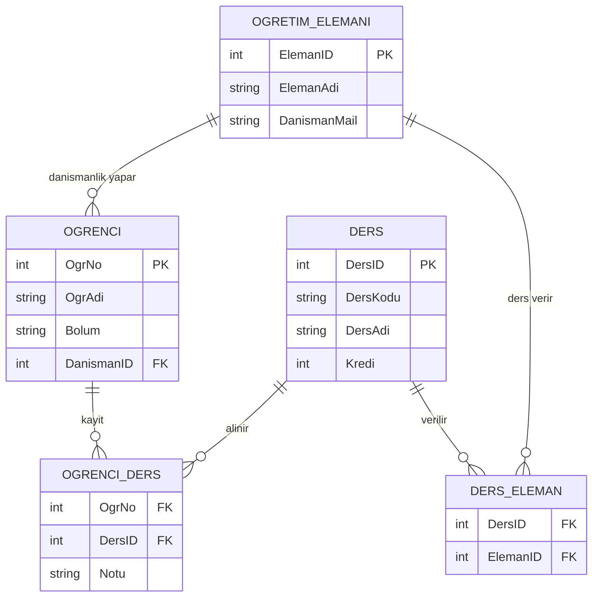

# veritabani-_normalizasyonu
Tek tablodan oluşan bozuk bir ders kayıt sisteminin teşhis edilip 3NF'e normalize edilerek SQL Server'da yeniden tasarlanması. Yüksek lisans veritabanı projesi.
# OBS — Ders Kayıt Sistemi (Veritabanı Yeniden Tasarımı)

Bozuk, tek tablodan oluşan bir ders kayıt sisteminin **teşhis edilip normalize edilerek** Microsoft SQL Server üzerinde yeniden tasarlanması.

> Haliç Üniversitesi — Yönetim Bilişim Sistemleri **Yüksek Lisans** — *Veritabanı Yönetimi* dersi final projesi. Tasarım, normalizasyon ve SQL uygulaması tarafımdan yapılmıştır.

---

## Problem

Bir yazılım şirketi, küçük bir üniversite için tüm verileri **tek bir tabloda** tutan bir ders kayıt sistemi geliştirmiş. Sistem çalışıyor ama: kullanıcılar sürekli hata bildiriyor, raporlar yanlış çıkıyor ve yeni özellik eklemek giderek zorlaşıyor.

Başlangıçtaki tablo, dersleri yan yana sütun olarak tutuyordu:

| OgrNo | OgrAdi | Bolum | Danisman | DanismanEposta | Ders1 | Ders1Kredi | Ders1Not | Ders2 | ... | Ders3Not |
|------|--------|-------|----------|----------------|-------|-----------|----------|-------|-----|----------|
| 1001 | Ayşe Yılmaz | Yazılım | Dr. Kaya | kaya@uni... | VTY | 3 | AA | İstatistik | ... | BB |

**Amaç:** Bu tasarımın problemlerini tespit etmek, veritabanını normalize etmek, yeniden tasarlamak ve SQL ile hayata geçirmek.

---

## 1. Tespit edilen problemler

1. Ders 1, ders 2 ve ders 3 için ayrı sütunlar açılmış ve ders sayısı 3 ile sınırlandırılmış. 4. Ders açılmak istenirse yeni sütun eklenmesi gerekiyor. Derslerin hepsi tek sütunda olmalı ve ders ID ile temsil edilmeli. Bu sayede de INSERT INTO ile istediğimiz kadar ders sayısı eklenebilir, yeni sütun açmamıza gerek kalmaz.

2. Bütün bilgiler aynı satırda olduğu için ve her öğrencide tekrarlanacağı için, danışman mail adresi de her öğrenci satırında tekrar eder. Veri tekrarı problemi oluşur.

3. Danışman mailini değiştirecek olursa bütün satırların güncellenmesi gerekir, yazım hatası riski, güncelleme anomalisi ve yanlış veri girişi riski oluşur. Bundan dolayı danışman mail adresi öğrenci satırında açık bir şekilde bulunmasına gerek yok danışman tablosu oluşturup mail adresi Foreign Key ile tutabiliriz.

4. Ölçeklenebilirlik problemi, ders sayısı 3 ile sınırlandırılmış ve her öğrenciye ait bir danışman var. Derse ait öğretim üyesi ekleme imkanı yok ve ders ekleme imkanı da yok.

5. Örneğin Java dersinden bir öğrenci silmek istersek bütün veriler aynı satırda olduğundan dolayı direkt öğrenci ve bütün dersleri ve bilgileri sistemden silinir. Silme anomalisi.

6. Her dersin kredisi ayrı sütunda olduğu için aynı ders için farklı kredi yazılabilir herhangi bir engel yok. Veri tutarsızlığı oluşur. Bundan dolayı ders tablosu oluşturup krediyi de içinde tutabiliriz.

---

## 2. Normalizasyon

Tasarım adım adım üçüncü normal forma (3NF) taşındı:

- **1NF** — Tekrarlayan gruplar (`Ders1/2/3`) kaldırıldı; her öğrenci-ders ilişkisi ayrı satır oldu.
- **2NF** — Derse bağlı bilgiler (kredi vb.) ayrı bir `Ders` tablosuna taşındı.
- **3NF** — Danışmana bağlı bilgiler (e-posta) ayrı bir `OgretimElemani` tablosuna taşındı; öğrenci tablosunda yalnızca `DanismanID` kaldı.

Ortaya çıkan tablolar:

- `OgretimElemani(ElemanID, ElemanAdi, DanismanMail)`
- `Ogrenci(OgrNo, OgrAdi, Bolum, DanismanID)`
- `Ders(DersID, DersKodu, DersAdi, Kredi)`
- `OgrenciDers(OgrNo, DersID, Notu)` — öğrenci ile dersi bağlayan ara tablo
- `DersOgretimElemani(DersID, ElemanID)` — ders ile öğretim elemanını bağlayan ara tablo

---

## 3. Yeni tasarım (ER diyagramı)



Aşağıda, aynı tasarımın SQL Server Management Studio (SSMS) üzerinde oluşturulmuş hali görülmektedir:


Tasarım, projenin gereksinimlerini karşılar:

- **Öğrenci birden fazla ders alabilir** → `OgrenciDers` ara tablosu (çoka-çok).
- **Bir dersin birden fazla öğretim elemanı olabilir** → `DersOgretimElemani` ara tablosu (çoka-çok).
- **Bir öğretim elemanı birden fazla danışmanlık yapabilir** → `Ogrenci.DanismanID` (bire-çok).
- **Yeni ders eklenebilir** → `Ders` tablosuna basit bir `INSERT`; sütun açmaya gerek yok.

---

## 4. SQL uygulaması

Tüm SQL kodu tek bir betikte toplanmıştır: [`SQLQuery1.sql`](SQLQuery1.sql). Betik sırayla şunları içerir:

1. Veritabanı ve tabloların oluşturulması (PRIMARY KEY / FOREIGN KEY tanımları)
2. Her tabloya örnek kayıtlar
3. Örnek güncelleme komutları
4. `JOIN` ve `GROUP BY` içeren sorgular

Öne çıkan iki sorgu — hangi öğrencinin hangi dersi hangi notla aldığını listeleyen `JOIN` ve öğrenci başına toplam krediyi hesaplayan `GROUP BY`:

```sql
SELECT o.OgrAdi, d.DersAdi, od.Notu
FROM OgrenciDers od
JOIN Ogrenci o ON od.OgrNo = o.OgrNo
JOIN Ders    d ON od.DersID = d.DersID;

SELECT o.OgrAdi, SUM(d.Kredi) AS ToplamKredi
FROM OgrenciDers od
JOIN Ogrenci o ON od.OgrNo = o.OgrNo
JOIN Ders    d ON od.DersID = d.DersID
GROUP BY o.OgrAdi;
```

Bu sorguların SSMS üzerinde çalıştırılmış çıktıları:

**JOIN — öğrenci / ders / not:**


**GROUP BY — öğrenci başına toplam kredi:**


---

## Çalıştırma

1. Microsoft SQL Server ve SSMS (ya da Azure Data Studio) gerekir.
2. `SQLQuery1.sql` dosyasını açıp baştan sona çalıştırın.
3. Betiğin başındaki `CREATE DATABASE OBS` komutu veritabanını oluşturur; `USE OBS` ile bu veritabanına geçilir ve sonraki tüm komutlar burada çalışır.

---

## Kullanılan teknolojiler

- Microsoft SQL Server (T-SQL)
- SQL Server Management Studio (SSMS)

---

## Öğrenilenler

- Tekrarlayan grup / anomali tespiti ve 1NF–3NF normalizasyon süreci
- Çoka-çok ilişkilerin ara tablo (junction table) ile modellenmesi
- `PRIMARY KEY`, `FOREIGN KEY` ve bileşik anahtar tanımları
- `JOIN` ve `GROUP BY` ile birden fazla tablodan rapor üretme
